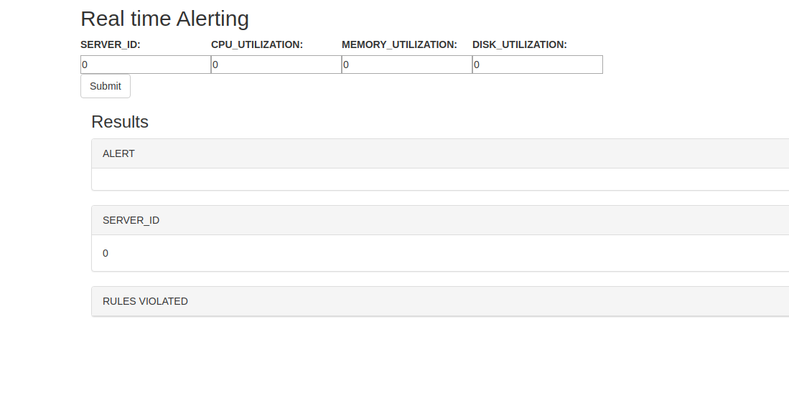
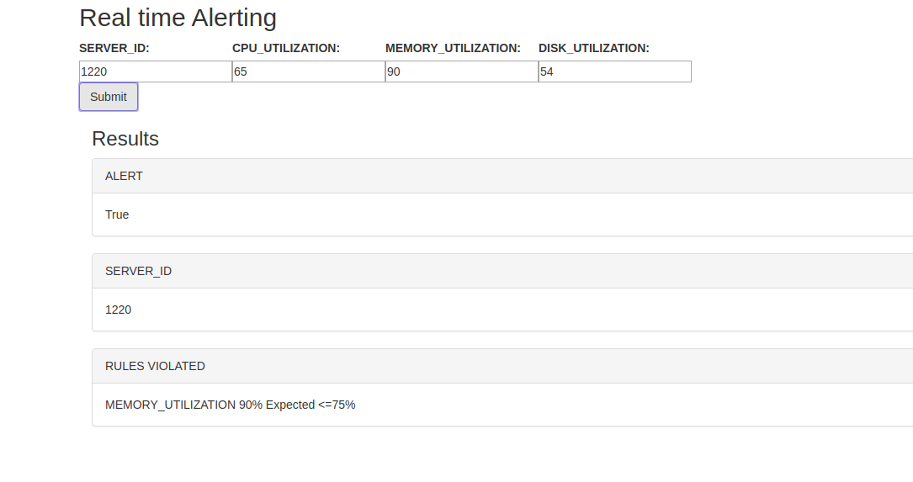

# Real-time-Alerting

Real Time Alerting is a mechanism to identify anomalies in the system as it occurs(and not afterwards)and use it for various purposes like reporting, blocking or corrective actions.

According to the problem statement an alert should be generate when either-

- CPU_UTILIZATION>85%
- MEMORY_UTILIZATION>75%
- DISK_UTILIZATION>60%

## Task checklist

I have completed all the base and bonus tasks.

- [x] A reusable Python class to generate alert with given list of rules(BASE TASK)
- [X] Make it a REST API based interaction(BONUS TASK)
- [X] Write validating unit tests(SUPER BONUS TASK)

The REST API function is in `realtimeapp/views.py` with name `alert`.
The unit tests for the API are in `realtimeapp/tests.py`.

In addition to these tasks, I have also developed a client side, base code for which is in
`frontend/src/components/App.js`. The API can be tested with `command line`, `Kafka-Python` and using the
developed `client`.

## Tech Stack used

- `Django` for writing the REST API(server side)
- `Rect.js` for writing the frontend(client side)
- `Kafka-Python` as an input provider to test the API.

## Setting up the application

Clone the repository.

```
git clone https://github.com/Aniket21mathur/Real-time-Alerting
```
Or if you already have a local copy go to the root of the repository.

```
cd Real-time-Alerting
```

Create and activate a new Python3 virtual environment.

```
python3 -m venv venv
source venv/bin/activate
```

Pip install all the dependencies from `requirements.txt`.

```
pip3 install -r requirements.txt
```

Run the server.

```
python3 manage.py runserver
```

Go to `http://localhost:8000/` to see the app up and running!

## Demonstration using Command Line

To test the API using command line, run the server.

```
python3 manage.py runserver
```

Install `curl`.

```
sudo apt install curl
```

Run the following command on the command line.

```zsh
curl -d '{"SERVER_ID":1220, "CPU_UTILIZATION":50, "MEMORY_UTILIZATION":10, "DISK_UTILIZATION": 40}' -H 'Content-Type: application/json' http://localhost:8000/realtimeapp/
```
this will return a response

```
{"ALERT": "False", "SERVER_ID": 1220}
```
which was expected as per the problem statement, as no rules are voilated.

Now try

```zsh
 curl -d '{"SERVER_ID":1220, "CPU_UTILIZATION":94, "MEMORY_UTILIZATION":80, "DISK_UTILIZATION": 70}' -H 'Content-Type: application/json' http://localhost:8000/realtimeapp/
```
this will return

```
{"ALERT": "True", "SERVER_ID": 1220, "RULES_VIOLATED": ["CPU_UTILIZATION 94% Expected <=85%", "MEMORY_UTILIZATION 80% Expected <=75%", "DISK_UTILIZATION 70% Expected <=60%"]}
```
as all the rules are voilated.

Now giving an input which voilates only 2 rules

```zsh
curl -d '{"SERVER_ID":1220, "CPU_UTILIZATION":94, "MEMORY_UTILIZATION":80, "DISK_UTILIZATION": 55}' -H 'Content-Type: application/json' http://localhost:8000/realtimeapp/
```
we get the following output

```
{"ALERT": "True", "SERVER_ID": 1220, "RULES_VIOLATED": ["CPU_UTILIZATION 94% Expected <=85%", "MEMORY_UTILIZATION 80% Expected <=75%"]}
```

## Demonstration using React UI

I have developed a `React.js` UI which makes it easier of a user to interact with the API.

To access the UI, run

```
python3 manage.py runserver
```

visit `http://localhost:8000/` to see the UI!



Experiment with the input fields and observe the expected results!



The images for the UI can be found in `images/`.
